# AngularCaseStudy

# Screenshots:

1. Set User Profile:

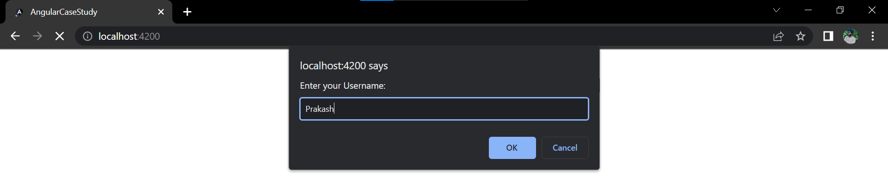

2. View User Profile:

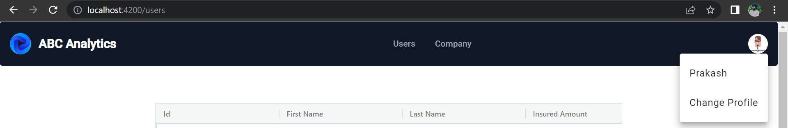

3. Users HomePage:

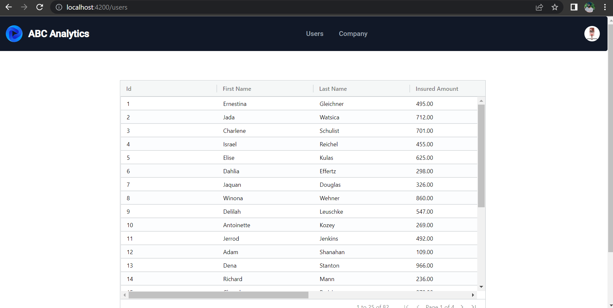

4. Add New User:

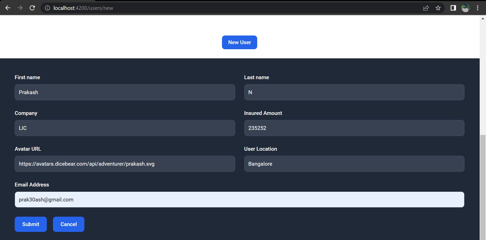

5. After Adding New User:

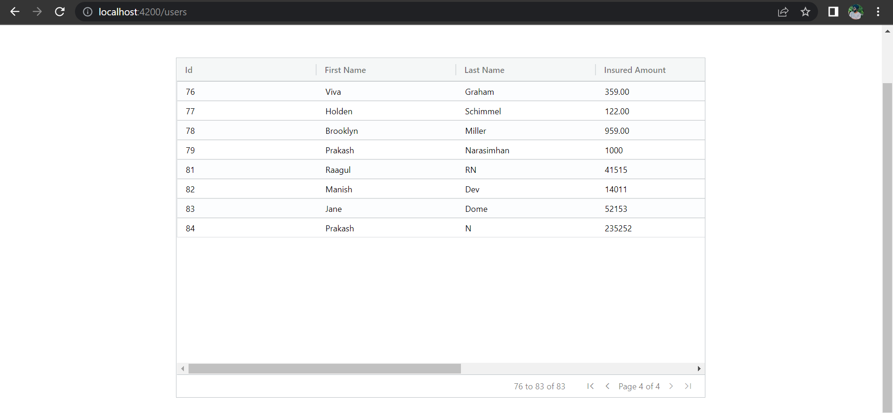

6. Update Existing User:

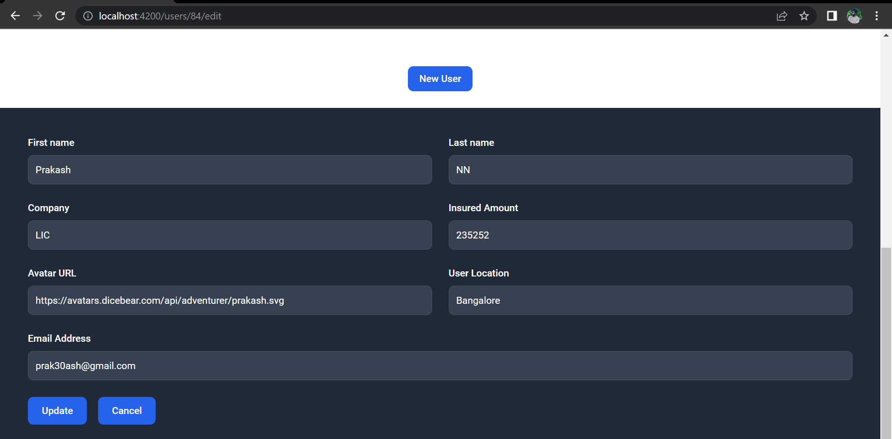

7. After Updating User:

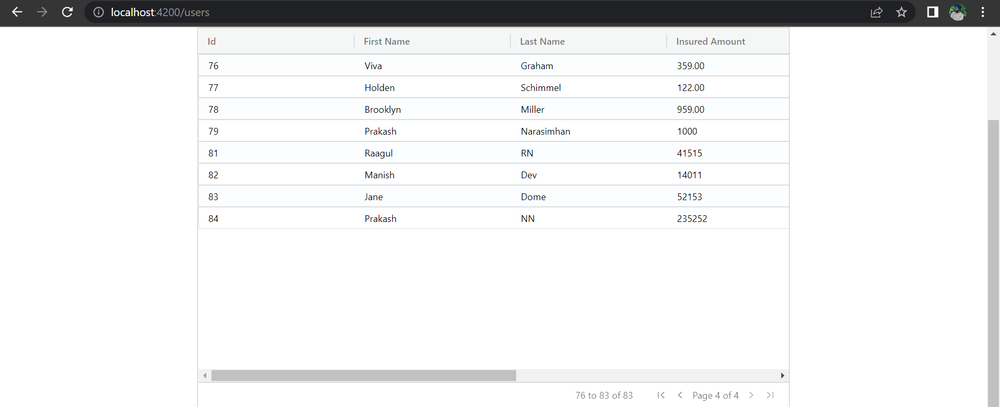

8. Delete User:

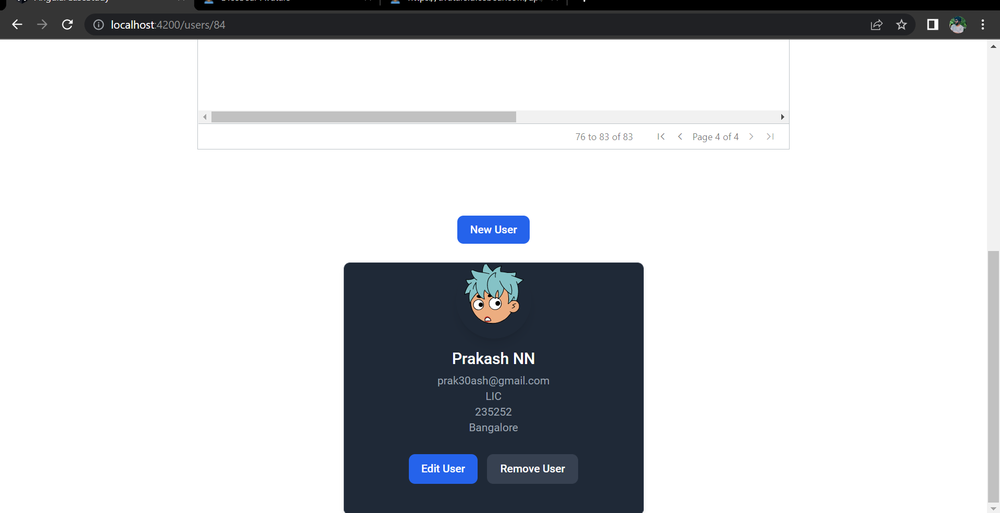

9. After Deleting User:

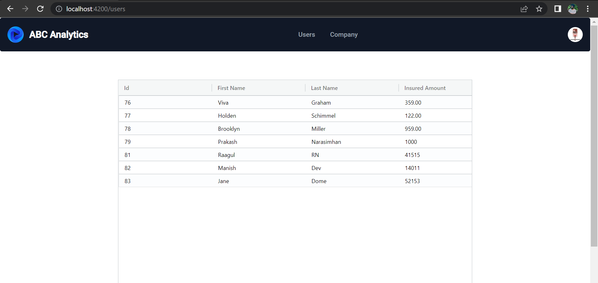

10. Search User:

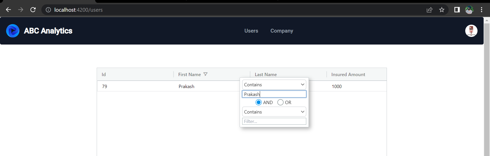

11. Display User:

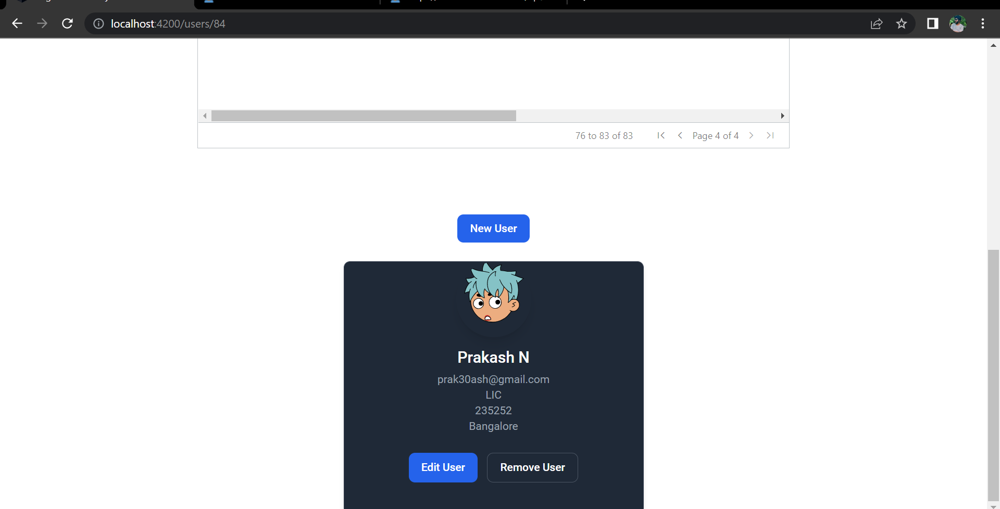